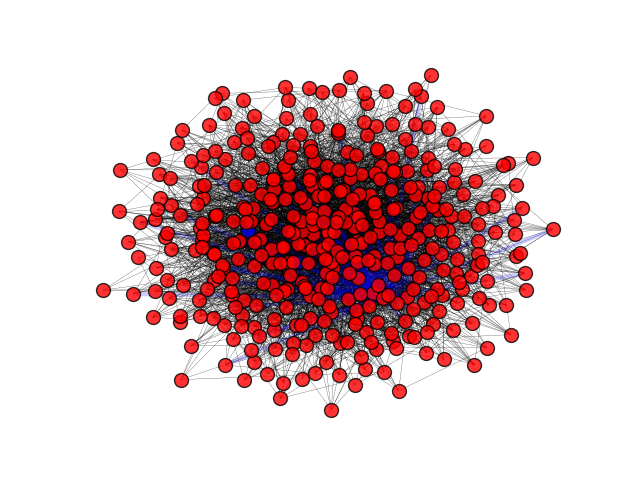
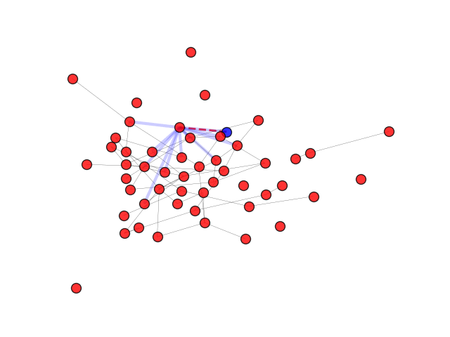

# La diffusion des mèmes parmi les reseaux sociaux

> **Quels critères influencent la visibilité d'un même?**

## Le mème

L’intéresse commun pour la mémétique et les mots de Richard Dawkins ont
formé le binome auteur de ce document. Il se propose de analyser et
comprendre l’interaction des mèmes sur internet et en particulier sur
les réseaux sociaux. Pour arriver à cet objectif nous avons développé
nos dossiers personnels en se rapprochant à l’argument, puis nous avons
parcouru le sujet de la mémétique selon la méthode de l’OLMDP pour en
comprendre l’ensemble et conclure sur la spécificité des réseaux.

//Definition meme

### Recherche bibliographique

* [Documentation sur le mème](doc.md)
* [Les lieux du mème](lieux.md)
* [Métiers et disciplines liées au mème](metiers.md)

Dans toutes les disciplines, la recherche documentaire, bibliographique n'est pas chose simple. Les sources d'information sont nombreuses, multiples. En dresser la liste est quasiment impossible. De plus, l'information devient tres vite inutilisable en fonction du temps. Elle se perime rapidement.
C'est pour celà qu'il faut avoir un interet du sujet ( les mèmes ). Dans une demarche documentaire, nous devons d'abord definir le champ d erecherche, c'est à dire le domaine intellectuel dans lequel elle  a s'exercer. par exemple le meme va t -il se diffuser que dans un domaine en particulier ou bien dans plusieurs domaines mais en meme temps ? Il faut en tenir compte dans notre recherche.

Dans le cas du mème, il existe plusieurs type de documents. Le document primaire désigne tout document original n'ayant subi aucune transformation comme les articles de periodiques, des livrs, des peintures, des gravures, et tout objets ou insstruments sources d'information.

* [Études dans ce champ](dejafait.md)

## Travail preliminaire

Le mème est un objet fascinant dont on semble connaitre le
fonctionnement, bien que celui demeure néanmoins difficile a reproduire
« artificiellement » car imprévisible. Par ailleurs aux vu des enjeux
naissant autour de cet objet, de plus de métiers vont venir éclaircir
ces problématiques dans les années à venir.

### Hypothèses

***Il y a des mèmes qui ont plus de facilité à survivre et à se diffuser.***

* différents réseaux ont des vitesses de diffusion différentes
* un mème réussit est forcement diffuse par la diffusion d'un compte important
* un mème contenant une choix A ou B a plus tendance à être diffusé
* en fonction du pays un reseaux est plus visible que les autres

### Formulation de la question

La formulation de la question doit, dans la plupart du temps, etre formulé par ses propres mots. Cependant, même si l'objectif est formulé selon nos propres mots, il est important d'avoir une liste d'informations ; une liste de termes retenus et non exhaustive.

### Critères d'évaluation

En general, un critere permet d'apprecier le degre d'atteinte des resultats, des objectifs.
Ce sont les reperes que l'on choisit pour servir de base à notre jugement. Ils precisent ce que l'on attend, sur quel aspect va porter notre jugement.
La liste des criteres pourrait etre grande, c'est à l'équipe de choisir ce qui est important pour elle, ce qu'elle attend plus precisemment comme prise de conscience, comme responsabilisation, comme amelioration.

### Les indicateurs

Ce sont les signes qui temoignent de l'existence d'un phenomene, d'un effet.
Ils sont observables, concrets et constituent les données que l'on va recueillir. Ils sont quantitatifs ou qualitatifs.

Encore une fois, il est necessaire de faire un choix parmi l'ensemble des indicateurs qu'il serait possible de prendre en compte.

L'indicateur doit aussi etre choisi en fonction de sparametres suivants.
    .Va-t-on pouvoir receuillir les données facilement ( en termes de competence pour faire ce recueil, de temps disponible, de moyens financiers...)?
    .Est-ce que recueillir cette information pourrait gêner les personnes.

Pour un même critere, il est possible de retenir un ou plusieurs indicateurs.

### Question à se poser

.Que vais-je observer ?    .Receuillir cette information me permettra t- elle de dire qu'il y aura une distribution de telle chose ou telle chose ?     . Comment recueillir l'expression des signes de difficulté à suivre un traitement ? ( en lien avec les mèmes ; par exemple )  . concretement que vais-je obeserver qui me montrera qu'il y a des iniatitives chez ce groupe de femmes ?

Une coherence est indispensable entre les objectifs, les strategies et les criteres d'evaluation.

### Outils d'evaluation

Ils permettent le recueil des données.
Attention, il ne faut pas les confondre avec les outils pédagogiques.
Il est preferable de construire ses propres outils car ils seront davantage adaptes aux indicateurs precis qui ont ete choisis pour ce projet et qui correspondent aux atenters de l'equipe.

### Exemple - le Microblog.

Comme son nom l'indique, il s'agit d'un derivé concis du blog web ou d'un web social. Cette idée a été developpé aaux Etats-Unis en 2006. Le Microblog permet des publications beaucoup plus courtes que dans les blogs classiques
L'objectif des Microblog est de diffuser plus fréquemment des informations en se limetant ; a du contenu utile, à mi-chemin entre messageries instantanée et blogs.
Comme les blogs, ils autorisent un archivage web ; et comme les messagerie instantanée ( messenger ) ils permettent la diffusion en temps reel des informations jugées pertinentes par leurs editeurs.

### Objectif

***Évaluer les critères de réussite d'un mème sur les réseaux sociaux et en modeliser la diffusion dans un environnement restreint.***

### Exemples d'objectifs

Par exemple, ameliorer la communication entre jeunes et adultes de la communauté educative du lycée. Les tendances des eleves au lycée prennent souvent le dessus. Mode qui se diffuse, tendances des jeunes.
    Les critres dans ce cas : Par ecxemple, diminuer cette tendance de l'"insolence" envers les adultes ou les professeurs.
    Indicateurs de cette tendance : Nombre d'avertisements pour l'insolence avant et apres l'action, l'acte.
    Outils utilisée : grille de suivi par exemple. 
    
    La tendance chez les jeunes à conduire sans casque, l'utilisation de la moto au lieu de la voiture.
    Objectifs dans ce cas là : la capacité de prendre une decision adaptée au risque.
    Outils d'evaluation : Par exemple, une echelle d'attitude sur la personne concernée.

## Modelisation

Modeliser l'integrité d'un réseaux sociaux avec tous les variables à tenir en compte est impossible car il demanderait une puissance de calcul en dehors des capacités de la pluspartie des ordinateurs.
Pour cette raison le modèle est constitué d'une façon simplifiée, contient un réseau restraint avec un calcul maximale sur un groupe de 500-700 personnes. Les amitiés sont réciproques, du coup il n'existe pas le concept de "follow": s'il y a une amitié entre A et B, les informations voyagent dans les deux sens.

De plus, chaque liaison est marquée par un poids qui peut varier de 0 à 1 et indique la proximité des deux individus, c'est à dire la probabilité et la fréquence des transitions des mèmes entre eux. Pour ce qui concerne les graphes on a choisir de raprésenter par un trait gris seulement les liaison les plus fortes afin de maintenir la propreté et facilité d'analyse.

Ensuite, un point critique a été le phenomnène de retour du mème à quelqu'un qui l'avait déjà: on a choisi d'avoir une probabilité de perdre le mème une fois qui'il le possède. Cela correspond dans la réalité au fait de perdre intêret das un fait ou arrêter d'utiliser une certaine façon de faire. Une fois que quelqu'un a perdu le meme, il n'aura plus la possibilté de le reprendre dans le cas qu'il le reçoit. Cela s'eloigne de la réalité, mais prendre en compte ce facteur nous obligerait à augmenter à la puissance 10 la quantité de nos calculs.

> Rapresentation d'un meme dans un network avec 400 personnes.

Ici il y a une simulation effectuée sur un network de 400 personne? Il est intéressant étudier la position des "nodes" autour du graphe.
Les nodes qui sont au centre ce sont ceux qui ont plus des liaison avec le plus des gens, et les nodes externes sont ceux qui sont "pauvres" d'amitiés.

Il est intéressant à noter qu'il y a des liaison qui deviennent rouges l'espace d'un frame, cela veut dire qu'il y a eu un passage d'information entre les deux nodes.

### Code

La partie de code a été divisée en trois grandes problematiques, ce qui correspond après à la subdivision en modules du programme:

* Creation d'un network qui soit manipulable représentable
* Insertion d'un mème dans le network et donner des loi de diffusion
* Assemblage des parties avec une facilité à changer les variables

Même si on n'a pas utilisé Jupyter Notebook pour coder ni rédiger notre projet, nous avons appuyé le code sur l'environnement Anaconda.
Par conséquent nous avons utilisés les librairies de numpy, matplotlib (en particulièr pyplot et animaton) et seaborn.

#### Network

[Code relatif](code/network.md)

La formation d'une structure pour le network a été largement facilité par l'introduction de la librairie networkx qui permet de former un network adapté à simuler un réseaux sociaux en peu de lignes.

Même si la mise en place d'un réseaux a été assez vite, la comprehension des fonctions fornies par la librairie, qui ont été utilisées pour la gestion du mème, a pris beaucoup plus de temps.

Enfin, l'implementation de networkx a été un grand pros pour le projet car il a permis de raprésenter visuellement les données calculées en forme des listes par le programme.

> Rapresentation d'un meme dans un network avec 50 personnes.

#### Meme

[Code relatif](code/ges_meme.md)

Le mème est manipulé comme un "attribute" des nodes qui ont ou pas le mème. Le cas positif ouvre la possibilité d'envoyer le mème aux individus avec laquelle il a une liaison selon la loi de probabilité définie sur les edges (càd les liaisons).

De plus, on a ajouté l'attribute "degout" qui détermine *a priori* des gens qui n'aimerons pas le mème et donc ne le retiendrons jamais.
Cet attribute s'applique aussi *a posteriori* aux nodes qui detiennent le mème et qui sont peut être en train de le partager, de cette façon quelq'un qui a déjà vu/imité le mème tendra avec le temps a ne plus s'identifier avec le groupe des gens ayant le mème.

### Finalisation

[Code relatif](code/manager.md)

blah blah

## Analyse

Tableau statistique:
20 simulations par cellule.

On a caculé la probabilité que le même survive plus de 20 générations

:spades:| 50 | 100 | 200 | 400
--------| ---| ----| ----| ---
0.2 | 10% | 20% | 50% | 65%
0.3 | 5% | 10% | 30% | 45%
0.5 | 0% | 5% | 15% | 30%

On a calculé la probabilité que le même atteigne 70% de diffusion

:hearts:| 50 | 100 | 200 | 400
--------| ---| ----| ----| ---
0.2 | 15% | 25% | 40% | 55%
0.3 | 5% | 15% | 35% | 45%
0.5 | 0% | 5% | 15% | 25%

On a calculé la probabilité qu'un même revienne à son expéditeur

:clubs:| 50 | 100 | 200 | 400
-------| ---| ----| ----| ---
0.2 | 25% | 65% | 90% | 98%
0.3 | 15% | 45% | 75% | 95%
0.5 | 5% | 35% | 65% | 80%

:diamonds:

## Conclusion

blah blah
