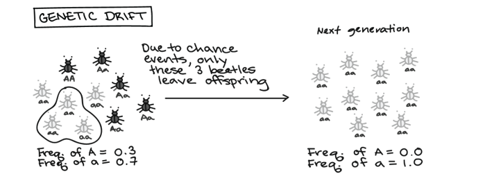
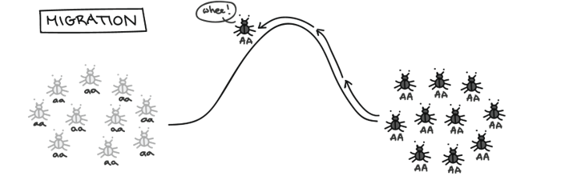
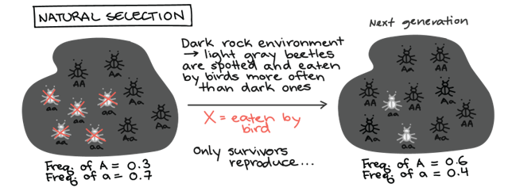

# Mèmes

## Objet

> *Cet objet a été choisi car loin de l’image que l’on s’en fait d’un
> sujet trivial et uniquement à visée humoristique, il s’agit de
> l’élément porteur d’une théorie qui apporte une réponse pertinente et
> originale Aux fonctionnements des comportements culturels. En effet,
> la mémétique étend la théorie de l’évolution a des phénomènes non plus
> naturels mais culturels. En proposant l’existence des mèmes qui
> évoluent de manière biologique on arrive à un modèle cohérent sans
> avoir besoins d’ajouter pléthore de nouvelles notions. D’autant plus
> que la mémétique se base sur des modèles très solides évolution
> darwinienne, entre autres. Aussi ayant
> remarqué la récurrence de même étapes dans l’évolution de plusieurs
> mèmes (internet), j’ai été attiré par la capacité à expliquer à l’aide
> de règle simple les schémas de variation et de sélection de ces
> mèmes.*

***Mots clés:*** Même – mémétique – néodarwinisme - gène égoïste -
théorie évolutionniste étendue

### Constituants

Le mème est l’unité de hérédité culturelle. Il s’agit d’un concept
abstrait, impossible à manipuler, il est possible que d’en analyser les
principes de fonctionnement. Il est constitué par le
réplicateur, une information codifiée qui produit copies exactes de soi
même avec des occasionnelles copies incorrectes ou “mutations”. Les
réplicateurs mieux adaptés à faire des copies de soi même deviennent
plus nombreux, contrairement aux moins dotés.

Dans le monde des mèmes, les éventuels défauts de réplication
(mutations) provoquent une variété du même mème dans le pool mémétique
et les différents variantes pourront être en competition entre elles. La
compétition se déroule sur le plan de la phénotypique, c’est à dire sur
le comportement général d’un mème dans la société. Le destin d’un mème
dépend de sa transmission parmi les individus et les groupes ethniques.
 Avec le temps, les mèmes augmentent ou diminuent de fréquence
dans le pool mémétique selon des caractères phénotypiques que les
représentent. De plus, les mèmes coopérants ont une probabilité majeure
d’émerger.

Les mèmes ont une capacité et fidélité élevées de transmission des
données, même si dans certains cas ils peuvent rester inactifs pendant
longtemps.

Exemple: le jeu du passe-mot avec une technique plus avancée, puis avec
un dessin (2 types d’information, analogique ou numérique/digitale)

Un “mémeplexe” est un complexe de mèmes qui, même s’ils ne sont pas
nécessairement capables de survivre tous seuls, sont capables de
survivre en présence des autres mèmes du mémeplexe.

### Caractéristiques

Il peut s’agir d’élément triviaux (blague récurrente, symbole
populaire), ou d’un objet d’une importance capitale (une langue, une
éthique). Le mème a une durée qui peut être très variable de quelques
mois à plusieurs millénaires.

Selon cette hypothèse toute culture peut être décomposée en ces sous
unités transmissibles entre les membres. En fait tous les éléments
constitutifs de notre culture sont des mèmes. Une chanson, par exemple,
est un mème. Si je chante une chanson, je serais entendu par quelqu’un,
et la chanson que j’ai chantée sera dupliquée dans un nouveau cerveau,
et ainsi de suite. L’imitation permet la réplication.

La réplication est donc l’essence du même, une idée qui ne se réplique
plus, n’a plus cours, et donc « meure». Pour qu’un mème subsiste il faut
donc qu’il induise chez « l’hôte » un comportement susceptible d’être
imité, pour que celui-ci le propage à d’autres.

Selon la théorie de Dawkins, si le gène est le support de l’information
génétique, le même est celui de la culture. Ainsi donc, les mèmes
évoluent de la selon des lois analogue à celles qui régissent
l’évolution des gènes.

Ces lois sont :

* **Le principe de variation** : les instances sont differentes au sein de
    la « population » (c’est difference son dûes au mode de réplication.
    Pour filer la métaphore, il peut s’agir d’une mauvaise imitation de
    l’air ou des paroles de la chanson, ou bien d’une parodie, d’un
    détournement)

* **La selection du plus apte** : les instances qui auront une forme (ou
    un contenu) favorisant la réplication, seront sélectionnés les
    autres seront oubliés. En d’autres termes les mèmes les plus
    imitables perdurent.

Cependant plus un même est répliqué plus il accumule des variations : il
peut donc donner naissance à plusieurs versions, voire des mèmes
dérivées. Ils peuvent aussi se combiner entre eux.

On notera aussi que plusieurs même en apparence différents peuvent
véhiculer une idée identique.

On peut se demander comment les mèmes peuvent-ils se répendre ? quel est
leur support ? En vérité il n’est pas aisé de dégager un support
privilégié, comme il serait difficile d’en dégager un pour la culture.
Néanmoins il est certain que les mèmes se véhiculent par tous les moyens
de communications, notamment inernet, d’où le terme « Internet
memes ».

### Méthodes d’obtentions

Les méthodes d’obtention d’un mème sont nombreuses et souvent ne
dépendent pas d’un individu ou d’une volonté spécifique.

Il faut analyser les deux phases: la création et la diffusion. La
création d’un mème est la conséquence de la mutation d’un mème déjà
existant. Ce mème peut se manifester dans la phénotypique avec la
variation de la façon de prononcer une lettre ou un mot, un tic, une
expression, la répétition d’une mot, l’acquis d’une nouvelle habitude. Le changement d’un individu ou d’une société par un seul mème
est minimal et invisible, il faut que le pool mémétique change d’un
0,02% afin que la différence soit visible (l’utilisation fréquente d’un
mot par un individu). Des phénomènes plus grands, comme un mouvement
artistique, sont provoqués par une multitude de mèmes qui collaborent
entre eux et qui sont partagés par plusieurs individus. Pour cela il
faut en analyser la diffusion. Les mèmes conceptuels, ceux qui
deviennent partie du pool des connaissances globales, sont souvent crées
par les acteurs d’un certain secteur. Par exemple, les mèmes contenants
les théories scientifiques sont le produit du travail des scientifiques.

Les mèmes se diffusent par le partage d’idées, par imitation, par copie,
par éducation, par influence, par diffusion sur les réseaux sociaux,
etc. La survie d’un mème est déterminée par sa diffusion entre les gens
et les contenants d’informations. Un livre est souvent la représentation
d’un système de stockage de mèmes. Il détient le façons de parler, de se
comporter, de s’habiller et de penser d’une époque spécifique. Le mème
peut être totalement inactif dans la société mais rien n’empêche qu’il
puisse à nouveau se diffuser grâce à quelqu’un qui lit le livre et en
assume des mèmes. Aujourd’hui, les réseaux sociaux sont le plus grand
système de partage de mèmes dans notre société, ils ont souvent une vie
très courte mais une résonance globale, il suffit de penser à la chanson
“Gangnam Style”.

### Historique de l’objet

Le meme a été théorisé par Richard Dawkins, biologiste, éthologiste et
théoricien de l’évolution, dans son essai  “The Selfish Gene” (Le Gène
égoïste).

Le terme a pour origine les mots « gène » et « mimesis ». En effet selon
R. Dawkins les cultures évoluent selon des lois analogues aux lois de
l’évolution de Darwin et Wallace, qui exerce une pression sur les gènes.
Les principes de variations et de sélection.

Le même et la théorie du mème (mémétique) s’inscrivent dans le
prolongement de la théorie de l’évolution a des objets non biologique,
dans le but de mieux comprendre le comportement des phénomenes

Il définit tout élément d’une culture ou d’un ensemble de comportements
répliqué et transmit d’un individu à un autre indépendamment de la
génétique. L’imitation par exemple, est le moyen privilégié. En d’autres
termes, c’est une idée qui a cours.

Etant défini comme l’unité de la culture, le mème n’a pas a proprement
parler d’origine. En effet le mème est aussi vieux que la culture
elle-même. Il a néanmoins connu de Nombreuses évolutions. A la fois en
ce qui concerne les supports de diffusions mais aussi dans leur portée.

A l’origine, les éléments culturels (les mèmes) était vraisemblablement,
communiqués par les gestes et la parole. Ils avaient donc une portée
locale, celle d’un groupe de personne réduit. L’arrivée de l’écriture
entraine la possibilité d’exporter les mèmes, d’échanger les cultures
plus loin et plus aisément, car les même peuvent ainsi durée plus
longtemps dans le temps qu’une simple parole. Enfin Internet et les
nouvelles technologies de communications rendent maximales la portée et
diversifie un peu plus les supports, tout en etant un moyen de partager
les mèmes de toutes sorte d manière efficace

### Aspect économique

Il serait malaisé de définir un impact économique des mèmes. En effet il
ne s’agit pas d’un terme désignant un objet précis, mais d’un concept
très vaste comme on a pu l’évoquer plus tôt. On pourrait néanmoins se
pencher sur un cas particulier. Les « mèmes internet » qui nous touchent
tous les jours sur les réseaux sociaux de l’internet, représentent une
manne financière importante quoi que difficile à exploiter. En
effet sur internet les mèmes populaires ont une durée de vie très
faible, ainsi il serait difficile d’envisager une vente rentable de
produit dérivée sur une durée de seulement quelques semaines. S’ajoute à
cela le caractère imprévisible de la popularité des mèmes.

### Les diverses utilisations

Le plus grand champ d’utilisation des mèmes et de la mémetique est dans
le secteur des études anthropologiques et sociologiques. En analyser le
fonctionnement permet aux experts de comprendre les ethnies et les
différentes cultures. Par exemple, Richard Dawkins, qui introduit le
terme, fait un grand excursus dans “L’illusion de Dieu” en expliquant la
présence et diffusion des idéaux religieux dans la société. Il examine
la mémétique et l’origine des mèmes “divins” dès l’antiquité et leur
parcours à travers l’humanité.

Le mème est amplement utilisé aujourd’hui dans le champ du
divertissement car tous les mouvements musicaux et artistiques dérivent
d’une transmission virale de certains mèmes. Tel comportement
reproductif explique l’instabilité générationnelle et la formation de
phénomènes très populaires mais ayant un arc temporel assez réduit. Cela
est hyperbolisé par l’avènement des réseaux sociaux qui sont un moyen
très efficace pour la transmission.

L’imitation, élément fondamental de la diffusion, est amplement utilisée
dans la politique, car les représentants veulent obtenir le consensus.
Cela est possible parmi un partage de valeurs, donc une exaspération des
mèmes qui sont le plus présents dans le pool mémétique local. Ce
phénomène peut avoir des résultats négatifs comme dans l’affaire italien
où le parti “Lega” a partagé les mèmes “défectueux” disant que les
vaccins provoquent l’autisme. L’utilisation médiatique de ce mème a eu
une résonance énorme dans la société, qui maintenant possède ce mème,
voir cette idée fausse. 

Enfin, la compréhension des mèmes offre une vaste capacité publicitaire,
car plus une publicité utilise les mèmes actuellement très diffus, plus
elle a une chance d’avoir des effets sur les individus qui les possèdent
et qui ont une majeure compatibilité. Pour cette raison, l’objectif
médiatique est d’impliquer une grande partie des gens à travers une
résonance constructive entre le mèmes de la publicité et des individus.

### Les applications

#### Études antropologiques et sociologiques

Les champs d’étude des mèmes se concentrent dans le secteur de la
sociologie qu’on définis “étude scientifique des sociétés humaines et
des faits sociaux” et “étude des groupes humains qui exercent un métier
(sociologie rurale), qui professent une foi, manifestent des croyances
(sociologie religieuse), qui s’intéressent à un phénomène culturel,
artistique (par exemplesociologie de la littérature)”. Dans ce cas la
mémétique représente l’instrument adapte à comprendre le passage des
usages et des langages entre les différentes tribus et cultures qui
peuvent apparemment n’avoir pas aucune relation.

En considérant le métier de Richard Dawkins, introducteur du terme mème,
on en déduit l’application dans le secteur de l’anthropologie
évolutionniste. Il est définis comme “l’étude de l’homme et des groupes
humains” ou comme la “théorie philosophique qui met l’homme au centre de
ses préoccupations”. Puis on observe son spécialisation sur
l’évolutionnisme qui considère que toute culture est le résultat d’un
processus constant d’évolution. Cela nous souligne l’application du
concept des mèmes dans l’analyse du processus de passage et diffusion
des “allèles” mémétiques dans les cultures et dans l’histoire.

#### Divertissement

Chaque entité du champ sémantique du divertissement, dans ses aspect
sociaux d’amusement et de distraction, dépend directement des mèmes car
ceux-ci ont besoin d’être partagés pour survivre. Cette affirmation est
applicable dans la musique, surtout dans la composition de forme libre
ou de forme suite, dans le théâtre et chaque loisir, en particulier ceux
qui se développent comme activité d’équipe. Divertissement dérive du
latin *divertere*, composé par *di* signifiant “de” voir éloignement et
*vertere* chargé du sens de “tourner”, donc envers un sentier autre
part. [@IL] Dans l’ensemble la mot énonce une activité qui procure
plaisir plaisir et qui tient l’âme loin des préoccupations.

#### Politique

La politique est l’ensemble des options prises collectivement ou
individuellement par les gouvernants d’un État dans quelque domaine que
s’exerce leur autorité (domaine législatif, économique ou social,
relations extérieures) voire la méthode particulière de gouvernement,
manière de gouverner. La mémétique est appliqué dans la recherche du
*consesus* à travers des sondages et des analyses statistiques sur les
intérêts et volontés des gens d’un secteur déterminé. Cette activité
permet de reconnaitre les mèmes membres d’une société, en suite ils
seront analysés et sélectionnes pour être assimilés par la figure du
parti ou du politicien. En effet, vu que il sont respectivement une
organisation structurée dont les membres mènent une action collective
dans la société aux fins de réaliser un programme politique et une
figure représentant une majorité du peuple, ils doivent partagés les
idéaux voir les mèmes avec la majeure partie.

#### Publicité

La publicité se manifeste comme une activité ayant pour but de faire
connaître une marque, d’inciter le public à acheter un produit, à
utiliser tel service, etc. ; ensemble des moyens et techniques employés
à cet effet (abréviation familière pub). Elle est concrètement un
annonce, un encart, un film, etc., conçus pour faire connaître et vanter
un produit, un service, etc. Dans ce domaine il s’applique le même
principe que pour la politique: il faut capturer le gents et cela est
possible seulement grâce à la correspondance dés mèmes car dans
l’histoire ancienne la reconnaissance tribale arrivait par la
comparaison des mèmes. S’ils étaient suffisamment
similaires, ça parait évidant d’être du même groupe sociale, c’est le
principe que permet aujourd’hui à des italiens de se reconnaitre entre
eux dans et hors de leur pais natal. Enfin, la publicité veut produire
le même effet pour être les plus familial et efficace.
